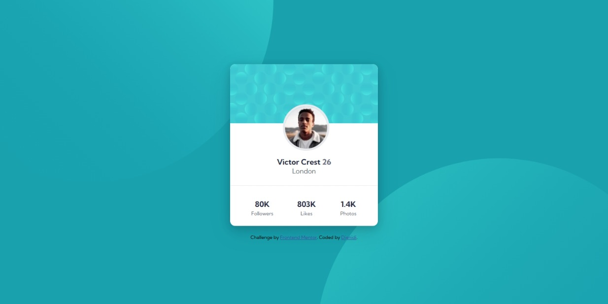
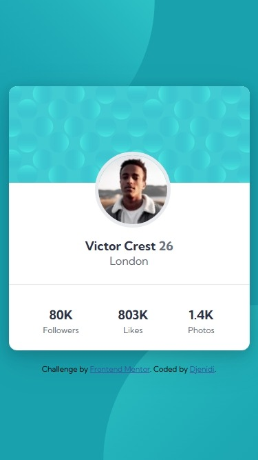

# Frontend Mentor - Profile card component

## Welcome! 👋

Thanks for checking out this front-end coding challenge.

[Frontend Mentor](https://www.frontendmentor.io) challenges help you improve your coding skills by building realistic projects.

**To do this challenge, you need a basic understanding of HTML and CSS.**

## Table of contents

- [Screenshot Desktop](#screenshot-desktop)
- [Screenshot Mobile](#screenshot-mobile)
- [Links](#links)
- [Author](#author)

### Screenshot Desktop

### Screenshot Mobile

### Links

- Solution [here](https://github.com/djenidisimple/djenidisimple.github.io-profile-card-component)
- Live Site [here](https://djenidisimple.github.io/djenidisimple.github.io-profile-card-component/)

## Author
- Website - [Djenidi](https://github.com/djenidisimple)